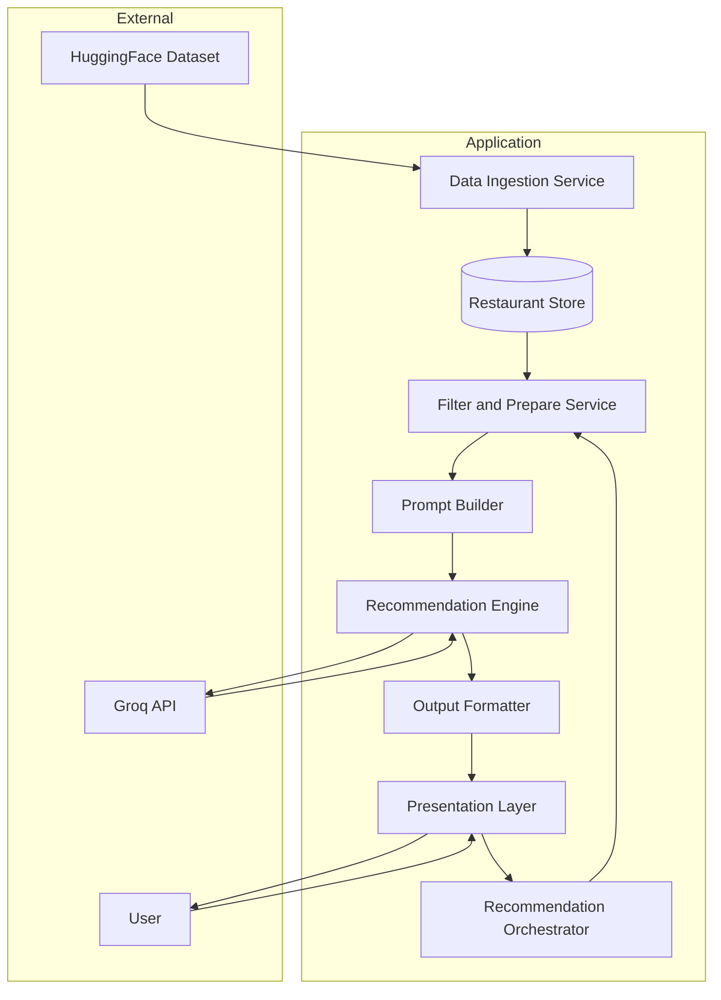
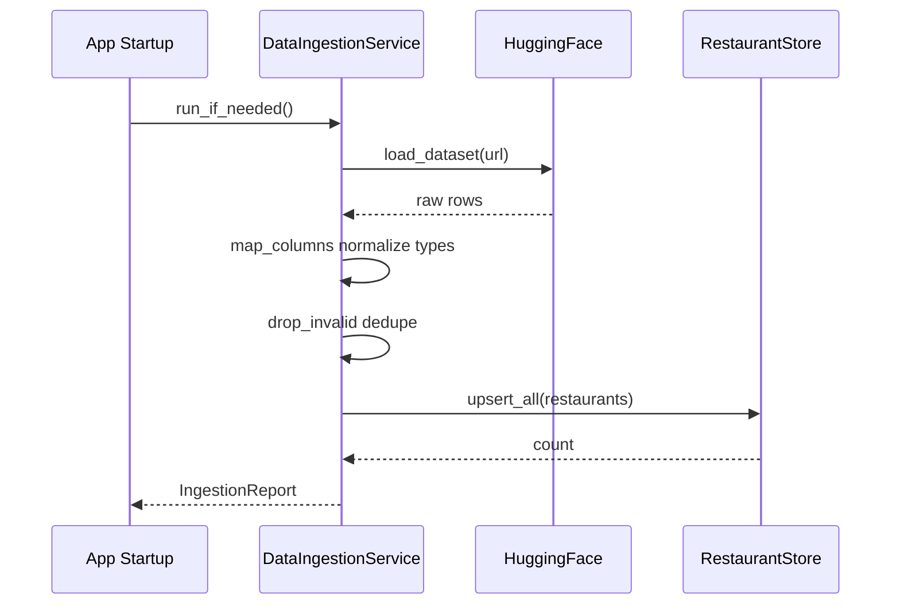
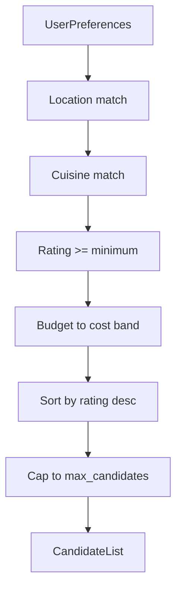
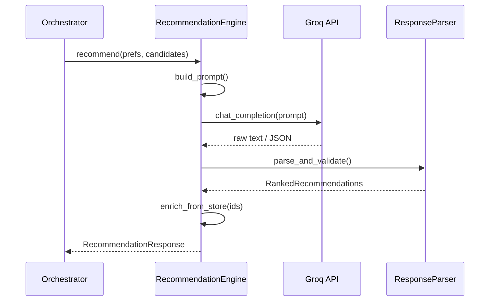
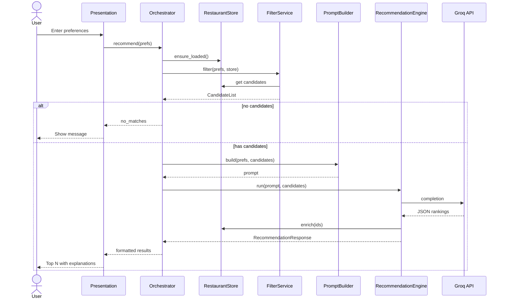

# System Architecture: AI-Powered Restaurant Recommendation (Epicurean Pulse)

This document defines the technical architecture for the Zomato-inspired restaurant recommendation service (branded as **Epicurean Pulse**) described in [context.md](./context.md). It translates product requirements into components, data flows, interfaces, and implementation guidance.

**Related documents**

| Document | Purpose |
|----------|---------|
| [context.md](./context.md) | Scope, objectives, workflow, I/O contracts |
| [design.md](./design.md) | Epicurean Pulse Design System (colors, typography, UI specs) |
| [ProblemStatement.txt](./ProblemStatement.txt) | Original assignment |

---

## 1. Architectural goals

| Goal | How the architecture supports it |
|------|----------------------------------|
| Preference-driven recommendations | Explicit filter layer before LLM; user prefs are first-class input |
| Grounded suggestions | LLM only sees dataset-backed candidates, not hallucinated venues |
| Human-like output | LLM ranks and explains; structured fields come from the dataset |
| Clarity for users | Stable output schema and presentation layer |
| Maintainability | Pipeline stages are separate modules with clear boundaries |
| Cost and latency control | Filter shrinks token payload; cache ingested data locally |

**Non-goals (v1)** — Per [context.md](./context.md#out-of-scope--tbd): user accounts, auth, persistent user history, multi-tenant deployment.

---

## 2. High-level architecture

The system is a **linear pipeline** with five logical layers. Each layer has a single responsibility; data flows forward only (no feedback loop in v1).



### Layer summary

| Layer | Responsibility | Primary outputs |
|-------|----------------|-----------------|
| Presentation | Collect prefs; render results | `UserPreferences`, rendered UI |
| Orchestrator | Wire pipeline; handle errors | `RecommendationResponse` |
| Data ingestion | Load, clean, normalize HF data | `Restaurant` records in store |
| Filter & prepare | Hard filters + candidate shortlist | `CandidateList` |
| Prompt builder | Serialize prefs + candidates for LLM | `PromptPayload` |
| Recommendation engine | Call LLM; parse structured reply | `RankedRecommendations` |
| Output formatter | Map to display schema | `RecommendationResult[]` |

---

## 3. Recommended technology stack

[context.md](./context.md) leaves stack choices open. The architecture below assumes a **Python** implementation (strong Hugging Face and LLM SDK support). Alternatives (Node, Java) can swap modules while keeping the same boundaries.

| Concern | Recommended choice | Rationale |
|---------|-------------------|-----------|
| Language | Python 3.11+ | `datasets`, pandas, widespread LLM SDKs |
| Dataset load | `datasets` (Hugging Face) | Native HF integration |
| Tabular processing | `pandas` | Filtering, normalization |
| Local cache | Parquet or SQLite | Fast restarts without re-downloading |
| LLM | **Groq** via `groq` SDK (OpenAI-compatible chat API) | Fast inference; pluggable `provider.py` |
| API surface (optional) | FastAPI | Thin REST wrapper over orchestrator |
| CLI / demo UI | Streamlit or terminal CLI | Fast preference input + result display |
| Config | `pydantic-settings` + `.env` | API keys outside code |
| Validation | `pydantic` v2 | Shared models across layers |

---

## 4. Component design

### 4.1 Data ingestion service

**Purpose:** Load the Zomato dataset once (or on schedule), preprocess, and persist a normalized restaurant catalog.



**Responsibilities**

- Download dataset from `https://huggingface.co/datasets/ManikaSaini/zomato-restaurant-recommendation`
- Map raw column names to internal schema (dataset-specific mapping table)
- Normalize: trim strings, parse ratings as float, normalize cost to numeric or band
- Drop rows missing required fields (name, location, rating)
- Deduplicate by stable key (name + location + address if available)
- Write to `RestaurantStore` (file-backed Parquet/SQLite for v1)

**Configuration**

| Parameter | Default | Description |
|-----------|---------|-------------|
| `DATASET_URL` | HF URL from context | Source dataset |
| `CACHE_PATH` | `./data/restaurants.parquet` | Local store path |
| `FORCE_REFRESH` | `false` | Re-download on startup |

---

### 4.2 Restaurant store

**Purpose:** In-process or file-backed read interface for the full catalog. Read-only after ingestion in v1.

**Interface (conceptual)**

```
get_all() -> list[Restaurant]
query_by_location(location: str) -> list[Restaurant]  # optional index
count() -> int
```

For v1, filtering can load the full table into memory if dataset size is modest (&lt;100k rows). If larger, add indexes on `location`, `cuisine`, `rating`, `cost_band`.

---

### 4.3 Filter and prepare service

**Purpose:** Apply deterministic filters from user preferences; produce a bounded candidate list for the LLM.



**Filter rules**

| Preference | Rule | Notes |
|------------|------|-------|
| Location | Case-insensitive substring or exact city match on `location` / `city` field | Normalize "Bangalore" vs "Bengaluru" via alias map if needed |
| Cuisine | Match if preference appears in restaurant `cuisines` list or string | Support multi-cuisine restaurants |
| Minimum rating | `rating >= min_rating` | Exclude null ratings |
| Budget | Map `low` / `medium` / `high` to cost bands (see §6.3) | Uses normalized `cost_band` or numeric `approx_cost_for_two` |
| Additional prefs | Not used in hard filter v1 | Passed to LLM only for reasoning |

**Candidate cap:** Default `max_candidates = 20` (configurable). Prevents token overflow and reduces LLM cost. If filters return zero rows, orchestrator returns a user-visible message without calling the LLM.

**Output:** `CandidateList` — ordered list of `Restaurant` summaries (subset of fields needed for prompt + display).

---

### 4.4 Prompt builder

**Purpose:** Construct a consistent, versioned prompt from `UserPreferences` and `CandidateList`.

**Prompt structure (sections)**

1. **System** — Role: restaurant recommendation assistant; must only recommend from provided list; output JSON only.
2. **User context** — Serialized preferences (all fields including additional prefs).
3. **Candidates** — JSON array of restaurants (id, name, location, cuisines, rating, cost).
4. **Instructions** — Rank top N; explain each pick; optional one-paragraph summary.
5. **Output schema** — JSON schema the LLM must return (see §5.3).

**Design principles**

- Include restaurant `id` so the engine can join LLM output back to dataset rows (avoids name collisions).
- Do not pass the full raw dataset—only filtered candidates.
- Version prompts (`prompt_v1.txt`) for reproducibility and A/B testing.

---

### 4.5 Recommendation engine (LLM)

**Purpose:** Call **Groq** (default provider), validate response, merge with dataset fields.



**Responsibilities**

- Invoke LLM with timeout and retry (exponential backoff, max 2 retries)
- Parse JSON; on failure, attempt repair or return structured error
- Validate: ranked ids exist in `CandidateList`; count ≤ requested top N
- Enrich: attach canonical name, cuisine, rating, cost from store (LLM must not override numeric rating/cost)

**LLM contract**

| Task | Owner |
|------|-------|
| Rank order | LLM |
| Per-restaurant explanation | LLM |
| Optional summary | LLM |
| Name, cuisine, rating, cost values | Dataset (enrichment) |

**Failure modes**

| Condition | Behavior |
|-----------|----------|
| Empty candidates | Skip LLM; return `no_matches` |
| LLM timeout | Return error with retry suggestion |
| Invalid JSON | One repair prompt; else error |
| Unknown restaurant id in response | Drop entry; log warning |

---

### 4.6 Output formatter and presentation layer

**Purpose:** Map internal `RecommendationResponse` to the user-facing schema from [context.md](./context.md#output-schema).

**Display fields (per recommendation)**

- Restaurant name (from store)
- Cuisine (from store)
- Rating (from store)
- Estimated cost (from store, labeled for user's budget context)
- AI-generated explanation (from LLM)

**Presentation options (pick one for v1)**

| Option | Pros | Cons |
|--------|------|------|
| Streamlit web app | Rich forms, fast demo | Extra dependency |
| Terminal CLI | Minimal setup | Less polished |
| FastAPI + simple HTML | API-first | More boilerplate |

Architecture supports all three via a thin adapter over `RecommendationOrchestrator`.

For v1, the **Streamlit web app** presentation is selected, branded as **Epicurean Pulse**. The user interface is implemented according to the design tokens and component guidelines outlined in [design.md](./design.md). It features a professional, minimal aesthetic using Montserrat typography, a crimson-based palette (`#d31027` primary accent), and custom CSS styled elements for chips, inputs, and rationale cards.

---

### 4.7 Recommendation orchestrator

**Purpose:** Single entry point for the pipeline; coordinates services and aggregates errors.

```
recommend(user_preferences: UserPreferences) -> RecommendationResponse
```

**Pipeline steps**

1. Ensure store is loaded (`DataIngestionService.run_if_needed()`)
2. `FilterService.filter(prefs, store)` → `CandidateList`
3. If empty → early return
4. `PromptBuilder.build(prefs, candidates)` → prompt
5. `RecommendationEngine.recommend(prompt, candidates)` → ranked + explanations
6. `OutputFormatter.format(...)` → `RecommendationResponse`
7. Return to presentation layer

---

## 5. Data models

### 5.1 Core entities

```mermaid
erDiagram
  Restaurant ||--o{ Candidate : shortlisted_as
  UserPreferences ||--|| RecommendationRequest : defines
  Candidate ||--o{ RankedRecommendation : ranked_into
  RecommendationResponse ||--|{ RankedRecommendation : contains

  Restaurant {
    string id PK
    string name
    string location
    string city
    list cuisines
    float rating
    float approx_cost
    string cost_band
  }

  UserPreferences {
    string location
    enum budget
    string cuisine
    float min_rating
    string additional_prefs optional
  }

  RankedRecommendation {
    string restaurant_id FK
    int rank
    string explanation
  }

  RecommendationResponse {
    list recommendations
    string summary optional
    string status
  }
```

### 5.2 `UserPreferences` (input)

| Field | Type | Validation |
|-------|------|------------|
| `location` | `string` | Non-empty |
| `budget` | `enum: low, medium, high` | Required |
| `cuisine` | `string` | Non-empty |
| `min_rating` | `float` | 0.0–5.0 (or dataset max) |
| `additional_preferences` | `string \| null` | Optional free text |

### 5.3 LLM response schema (parsed JSON)

```json
{
  "summary": "Optional short overview of the selection.",
  "recommendations": [
    {
      "restaurant_id": "string",
      "rank": 1,
      "explanation": "Why this fits the user's preferences."
    }
  ]
}
```

### 5.4 `RecommendationResult` (output to user)

| Field | Source |
|-------|--------|
| `restaurant_name` | Store |
| `cuisine` | Store (joined string if list) |
| `rating` | Store |
| `estimated_cost` | Store (formatted, e.g. "₹800 for two") |
| `explanation` | LLM |
| `rank` | LLM |

Default **top N = 5** (configurable via `TOP_N`).

---

## 6. Key design decisions

### 6.1 Why filter before LLM?

- **Cost:** Smaller prompts.
- **Accuracy:** LLM cannot invent restaurants outside the candidate list.
- **Latency:** Fewer tokens → faster responses.

Soft preferences (family-friendly, quick service) are intentionally **LLM-only** in v1—they influence ranking and explanations but not SQL/pandas hard filters.

### 6.2 Id-stable candidates

Every restaurant in the candidate payload carries an `id` generated at ingestion. The LLM returns `restaurant_id`; the engine joins back to the store for display fields.

### 6.3 Budget-to-cost mapping (v1 proposal)

Until dataset statistics are profiled, use configurable bands on normalized `approx_cost_for_two` (INR):

| Budget | Cost range (approx for two) |
|--------|----------------------------|
| `low` | 0 – 500 |
| `medium` | 501 – 1500 |
| `high` | 1501+ |

Tune thresholds after inspecting the HF dataset distribution; document final values in config.

### 6.4 Prompt versioning

Store templates under `prompts/` (e.g. `recommend_v1.system.txt`, `recommend_v1.user.jinja2`). Orchestrator references `PROMPT_VERSION` env var.

---

## 7. Proposed repository layout

```
zomato-milestone/
├── docs/
│   ├── context.md
│   ├── architecture.md          # this file
│   └── ProblemStatement.txt
├── data/                        # gitignored: cached parquet/db
├── prompts/
│   ├── recommend_v1.system.txt
│   └── recommend_v1.user.jinja2
├── src/
│   └── restaurant_recommender/
│       ├── __init__.py
│       ├── config.py            # settings from env
│       ├── models.py            # pydantic: Restaurant, UserPreferences, etc.
│       ├── ingestion/
│       │   ├── loader.py        # HF download
│       │   └── normalizer.py    # column mapping, cleaning
│       ├── store/
│       │   └── restaurant_store.py
│       ├── filtering/
│       │   ├── filter_service.py
│       │   └── budget.py        # budget band logic
│       ├── llm/
│       │   ├── prompt_builder.py
│       │   ├── engine.py
│       │   ├── provider.py      # abstract + Groq/mock impl
│       │   └── parser.py
│       ├── formatting/
│       │   └── output_formatter.py
│       ├── orchestrator.py
│       └── app/
│           ├── cli.py           # or streamlit_app.py
│           └── api.py           # optional FastAPI
├── tests/
│   ├── test_filter_service.py
│   ├── test_prompt_builder.py
│   └── test_parser.py
├── .env.example
├── requirements.txt
└── README.md
```

---

## 8. End-to-end request flow



---

## 9. Configuration and secrets

| Variable | Required | Description |
|----------|----------|-------------|
| `LLM_API_KEY` | Yes | Groq API key ([Groq Console](https://console.groq.com/keys)) |
| `LLM_MODEL` | Yes | e.g. `llama-3.3-70b-versatile` (see [Groq models](https://console.groq.com/docs/models)) |
| `LLM_PROVIDER` | No | `groq` (default), `mock` for tests |
| `DATASET_URL` | No | Override HF URL |
| `CACHE_PATH` | No | Local restaurant cache |
| `MAX_CANDIDATES` | No | Default 20 |
| `TOP_N` | No | Default 5 |
| `PROMPT_VERSION` | No | Default `v1` |

Never commit `.env`; provide `.env.example` only.

---

## 10. Observability and operations (v1 light)

| Signal | Implementation |
|--------|----------------|
| Structured logs | JSON logs per stage: ingestion count, filter count, LLM latency |
| Metrics (optional) | `candidates_count`, `llm_latency_ms`, `recommendation_success` |
| Health check | API `/health` returns store loaded + row count |

---

## 11. Testing strategy

| Layer | Test type | Focus |
|-------|-----------|-------|
| Ingestion | Unit + fixture | Column mapping, invalid row drops |
| Filter | Unit | Each preference dimension; empty result |
| Prompt builder | Snapshot | Stable prompt given fixed inputs |
| Parser | Unit | Valid JSON, malformed JSON, unknown ids |
| Engine | Integration (mock LLM) | End-to-end with canned LLM response |
| Orchestrator | Integration | No candidates path; happy path |

Use a small **fixture CSV** (10–20 rows) in tests to avoid HF network calls in CI.

---

## 12. Security considerations

- API keys only via environment variables
- No user PII in v1; preferences are ephemeral per request
- Validate and bound all user inputs (max string length on `additional_preferences`)
- Sanitize LLM output before rendering in UI (escape HTML if web)

---

## 13. Future extensions

| Extension | Architectural impact |
|-----------|---------------------|
| User accounts / history | Add persistence layer; orchestrator reads past prefs |
| Semantic cuisine/location match | Embedding index between filter and LLM |
| Feedback loop | Store thumbs up/down; fine-tune ranker |
| Caching recommendations | Redis keyed by hash of prefs + candidate set version |
| Multi-city batch | Async job queue for bulk runs |

---

## 14. Traceability to context.md

| context.md section | Architecture section |
|--------------------|----------------------|
| Objectives | §1, §2 |
| Data source | §4.1, §4.2 |
| User inputs | §5.2, §4.3 |
| System workflow (5 stages) | §2, §4.1–4.7, §8 |
| LLM responsibilities | §4.5, §6.1 |
| Output schema | §5.4, §4.6 |
| Out of scope / TBD | §1 non-goals, §6.3, §4.6 presentation options |

---

## 15. Implementation order

1. **Models + config** — Pydantic types, settings
2. **Ingestion + store** — HF load, normalize, Parquet cache
3. **Filter service** — Including budget bands after data profiling
4. **Prompt builder + parser** — Before live LLM calls
5. **LLM provider + engine** — Mock provider for tests first
6. **Orchestrator + formatter**
7. **Presentation** — CLI or Streamlit
8. **Tests + README** — Run instructions and `.env.example`

This order delivers a testable pipeline early and adds the LLM only once structured paths are stable.
