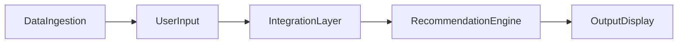

# Project Context: AI-Powered Restaurant Recommendation System (Epicurean Pulse)

## Project overview

Build an AI-powered restaurant recommendation service inspired by Zomato, branded as **Epicurean Pulse**. The system intelligently suggests restaurants based on user preferences by combining structured restaurant data with a Large Language Model (LLM). Structured filtering narrows candidates; the LLM produces personalized, human-like rankings and explanations.

## Objectives

Design and implement an application that:

- Takes user preferences (location, budget, cuisine, ratings, and optional extras)
- Uses a real-world dataset of restaurants
- Leverages an LLM to generate personalized, human-like recommendations
- Displays clear and useful results to the user

## Data source

| Item | Detail |
|------|--------|
| Dataset | Zomato restaurant data on Hugging Face |
| URL | https://huggingface.co/datasets/ManikaSaini/zomato-restaurant-recommendation |

### Ingestion requirements

- Load and preprocess the dataset from Hugging Face
- Extract relevant fields, including but not limited to:
  - Restaurant name
  - Location
  - Cuisine
  - Cost
  - Rating

## User inputs

Collect the following user preferences:

| Field | Type / examples | Required |
|-------|-----------------|----------|
| Location | City or area (e.g. Delhi, Bangalore) | Yes |
| Budget | `low`, `medium`, or `high` | Yes |
| Cuisine | Type (e.g. Italian, Chinese) | Yes |
| Minimum rating | Numeric threshold | Yes |
| Additional preferences | Free-text (e.g. family-friendly, quick service) | Optional |

## System workflow

End-to-end pipeline:

### 1. Data ingestion

- Load and preprocess the Zomato dataset from Hugging Face
- Extract fields needed for filtering and display (name, location, cuisine, cost, rating, etc.)

### 2. User input

- Collect preferences: location, budget, cuisine, minimum rating, and any additional preferences

### 3. Integration layer

- Filter and prepare relevant restaurant data based on user input
- Pass structured results into an LLM prompt
- Design a prompt that helps the LLM reason and rank options

### 4. Recommendation engine

Use the LLM to:

- Rank restaurants
- Provide explanations (why each recommendation fits the user)
- Optionally summarize choices

### 5. Output display

- Present top recommendations in a user-friendly format (see [Output schema](#output-schema))

## LLM responsibilities

The LLM acts on **filtered, structured candidate data**, not the full raw dataset. It must:

1. **Rank** restaurants among the prepared candidates
2. **Explain** why each recommendation fits the user’s stated preferences
3. **Summarize** (optional) the set of choices at a high level

Prompt design in the integration layer should support reasoning and ranking over the structured subset passed in.

## Output schema

Each top recommendation shown to the user should include:

| Field | Description |
|-------|-------------|
| Restaurant name | Name from dataset |
| Cuisine | Cuisine type(s) |
| Rating | Restaurant rating |
| Estimated cost | Cost aligned with user budget context |
| AI-generated explanation | Why this pick fits the user’s preferences |

## v1 implementation decisions

| Topic | Choice |
|-------|--------|
| Language | Python 3.11+ |
| LLM | **Groq API** (`groq` SDK); `LLM_API_KEY`, default model `llama-3.3-70b-versatile` |
| Presentation | Streamlit (Phase 7) implementing the **Epicurean Pulse** visual design system ([design.md](./design.md)) |
| Top recommendations | 5 (`TOP_N`) |
| Budget bands (INR, approx for two) | low: 0–500, medium: 501–1500, high: 1501+ |

## Out of scope (v1)

- Authentication, persistence, or user accounts
- Live Zomato API integration

## Reference

Authoritative assignment text: [ProblemStatement.txt](./ProblemStatement.txt)
