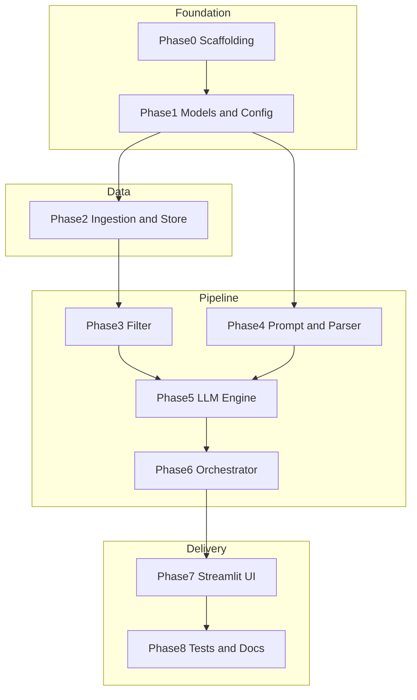

# Implementation Plan: AI-Powered Restaurant Recommendation (Epicurean Pulse)

Actionable build plan for the Zomato milestone project. Derived from [context.md](./context.md) (requirements), [architecture.md](./architecture.md) (technical design), and [design.md](./design.md) (visual style).

**Related documents**


| Document                                       | Role in this plan                       |
| ---------------------------------------------- | --------------------------------------- |
| [context.md](./context.md)                     | What to build; acceptance criteria      |
| [architecture.md](./architecture.md)           | How to build; components and interfaces |
| [design.md](./design.md)                       | Epicurean Pulse visual design & styling |
| [ProblemStatement.txt](./ProblemStatement.txt) | Original assignment                     |


---

## 1. Scope and success criteria

### 1.1 In scope (v1)


| #   | Requirement (from context)                                                        | Deliverable                              |
| --- | --------------------------------------------------------------------------------- | ---------------------------------------- |
| R1  | Load and preprocess Hugging Face Zomato dataset                                   | Cached `Restaurant` catalog on disk      |
| R2  | Collect user preferences (location, budget, cuisine, min rating, optional extras) | Validated `UserPreferences` input        |
| R3  | Filter and prepare candidates before LLM                                          | `CandidateList` (max 20 by default)      |
| R4  | LLM ranks, explains, optionally summarizes                                        | Parsed `RankedRecommendations`           |
| R5  | Display top results with required fields                                          | Name, cuisine, rating, cost, explanation |
| R6  | Grounded recommendations only from dataset                                        | Filter + id-based enrichment             |


### 1.2 Out of scope (v1)

Per [context.md](./context.md#out-of-scope--tbd) and [architecture.md](./architecture.md#1-architectural-goals): authentication, user accounts, recommendation history, multi-tenant deployment, semantic/embedding search.

### 1.3 Definition of done

The milestone is complete when a user can:

1. Start the app (CLI or Streamlit).
2. Enter preferences for a supported city/cuisine.
3. Receive up to **5** ranked restaurants with dataset-backed fields and LLM explanations.
4. See a clear message when no restaurants match filters (no LLM call).
5. Run `pytest` without network access (fixtures + mock LLM).
6. Follow `README.md` to configure `.env` and run locally.

---

## 2. v1 decisions (resolve TBD)

[context.md](./context.md) leaves several choices open. This plan locks them for implementation; update [context.md](./context.md) when confirmed.


| Decision                           | v1 choice                                   | Rationale                                                                                                  |
| ---------------------------------- | ------------------------------------------- | ---------------------------------------------------------------------------------------------------------- |
| Language                           | Python 3.11+                                | [architecture.md §3](./architecture.md#3-recommended-technology-stack)                                     |
| Presentation                       | **Streamlit** web app                       | Fast demo; meets “clear results” objective; conforms to the UI system in [design.md](./design.md)          |
| LLM provider                       | **Groq** via `groq` SDK                     | Fast chat completions; `provider.py` abstraction                                                           |
| Default model                      | `llama-3.3-70b-versatile`                   | Strong quality on Groq; swap via `LLM_MODEL`                                                               |
| Top N results                      | **5** (`TOP_N=5`)                           | Reasonable default; configurable                                                                           |
| Max candidates to LLM              | **20** (`MAX_CANDIDATES=20`)                | Token/cost control per architecture                                                                        |
| Local cache                        | **Parquet** at `./data/restaurants.parquet` | Fast reload per architecture                                                                               |
| Budget bands (INR, approx for two) | low: 0–500, medium: 501–1500, high: 1501+   | [architecture.md §6.3](./architecture.md#63-budget-to-cost-mapping-v1-proposal); tune after data profiling |


---

## 3. Implementation phases overview




| Phase | Name                       | Status      | Est. effort | Blocks      |
| ----- | -------------------------- | ----------- | ----------- | ----------- |
| 0     | Project scaffolding        | Complete    | 0.5 day     | —           |
| 1     | Models and configuration   | Complete    | 0.5 day     | Phase 0     |
| 2     | Data ingestion and store   | Complete    | 1–1.5 days  | Phase 1     |
| 3     | Filter service             | Complete    | 1 day       | Phase 2     |
| 4     | Prompt builder and parser  | Complete    | 1 day       | Phase 1     |
| 5     | LLM provider and engine    | Complete    | 1–1.5 days  | Phase 4     |
| 6     | Orchestrator and formatter | Complete    | 0.5 day     | Phases 3, 5 |
| 7     | Streamlit presentation     | Complete    | 0.5–1 day   | Phase 6     |
| 8     | Tests, README, polish      | Not started | 1 day       | All         |


**Total estimate:** ~7–9 working days for one developer.

---

## 4. Phase 0: Project scaffolding

**Goal:** Runnable Python package skeleton matching [architecture.md §7](./architecture.md#7-proposed-repository-layout).

### Tasks

- Create directory structure under `src/restaurant_recommender/`
- Add `requirements.txt`:
  - `pydantic`, `pydantic-settings`
  - `datasets`, `pandas`, `pyarrow`
  - `groq`, `jinja2`
  - `streamlit`
  - `pytest`, `pytest-mock` (dev)
- Add `.gitignore` (`data/`, `.env`, `__pycache__/`, `.venv/`)
- Add `.env.example` with variables from [architecture.md §9](./architecture.md#9-configuration-and-secrets)
- Add empty `prompts/`, `tests/`, `data/` placeholders in docs only (data gitignored)
- Add minimal `README.md` stub (filled in Phase 8)

### Deliverables


| Artifact     | Path                                     |
| ------------ | ---------------------------------------- |
| Package root | `src/restaurant_recommender/__init__.py` |
| Dependencies | `requirements.txt`                       |
| Env template | `.env.example`                           |


### Acceptance

- `python -m venv .venv && pip install -r requirements.txt` succeeds
- `import restaurant_recommender` works with `PYTHONPATH=src`

---

## 5. Phase 1: Models and configuration

**Goal:** Shared types and settings used by every layer ([architecture.md §5](./architecture.md#5-data-models)).

### Tasks

- Implement `config.py` with `pydantic-settings`:
  - `LLM_API_KEY`, `LLM_MODEL`, `LLM_PROVIDER` (`groq` default from Phase 5)
  - `DATASET_URL`, `CACHE_PATH`, `FORCE_REFRESH`
  - `MAX_CANDIDATES`, `TOP_N`, `PROMPT_VERSION`
- Implement `models.py`:
  - `Budget` enum: `low`, `medium`, `high`
  - `Restaurant` (id, name, location, city, cuisines, rating, approx_cost, cost_band)
  - `UserPreferences` with validation per architecture §5.2
  - `CandidateList`, `PromptPayload`
  - `LLMRecommendationItem`, `LLMResponse` (§5.3)
  - `RecommendationResult`, `RecommendationResponse` with `status` enum (`success`, `no_matches`, `error`)
- Add `Restaurant.generate_id()` helper (hash of name + location)

### Deliverables


| File                                   | Contents             |
| -------------------------------------- | -------------------- |
| `src/restaurant_recommender/config.py` | `Settings` singleton |
| `src/restaurant_recommender/models.py` | All pydantic models  |


### Acceptance

- Unit test: invalid `min_rating` or empty `location` raises validation error
- Settings load from `.env` without hardcoded secrets

---

## 6. Phase 2: Data ingestion and store

**Goal:** Satisfy [context.md § Data ingestion](./context.md#1-data-ingestion) and architecture §4.1–4.2.

### Tasks

- `**ingestion/loader.py`**
  - `load_raw_dataset(url)` using Hugging Face `datasets`
  - Handle first-run download; respect `FORCE_REFRESH`
- `**ingestion/normalizer.py**`
  - Map HF column names → internal schema (inspect dataset on first run; document mapping in code comments)
  - Parse `rating` as float; parse cost to `approx_cost` numeric
  - Assign `cost_band` from budget thresholds (Phase 2b: profile and tune)
  - Drop rows missing name, location, or rating
  - Deduplicate by generated `id`
- `**ingestion/service.py**` — `DataIngestionService.run_if_needed() -> IngestionReport`
- `**store/restaurant_store.py**`
  - `save_parquet(path)`, `load_parquet(path)`, `get_all()`, `get_by_id(id)`, `count()`
  - Skip HF download if cache exists and `FORCE_REFRESH=false`
- One-off script or test hook: print column names + cost distribution for budget tuning

### Deliverables


| File                        | Role                                 |
| --------------------------- | ------------------------------------ |
| `ingestion/loader.py`       | HF integration                       |
| `ingestion/normalizer.py`   | Cleaning rules                       |
| `ingestion/service.py`      | Orchestrates load → normalize → save |
| `store/restaurant_store.py` | Parquet-backed catalog               |


### Acceptance

- Running ingestion produces `./data/restaurants.parquet` with > 0 rows
- Each row has non-null `id`, `name`, `location`, `rating`
- Second run uses cache (no re-download unless `FORCE_REFRESH=true`)
- Unit test uses `tests/fixtures/restaurants_sample.parquet` (10–20 rows)

### Notes

- After first HF load, record actual column names in `normalizer.py` and update budget bands if distribution differs from defaults.

---

## 7. Phase 3: Filter service

**Goal:** Integration layer hard filters ([context.md § Integration layer](./context.md#3-integration-layer), architecture §4.3).

### Tasks

- `**filtering/budget.py`** — `matches_budget(restaurant, budget) -> bool`
- `**filtering/filter_service.py**`
  - Location: case-insensitive match on `city` or `location`
  - Cuisine: preference substring in `cuisines` (list or string)
  - Rating: `rating >= min_rating`
  - Budget: via `budget.py`
  - Sort by `rating` descending
  - Cap to `MAX_CANDIDATES`
  - Return `CandidateList` with slim dicts for prompt (id, name, location, cuisines, rating, approx_cost)
- Optional: `LOCATION_ALIASES` dict (`Bengaluru` → `Bangalore`) in config

### Deliverables


| File                          | Role                                 |
| ----------------------------- | ------------------------------------ |
| `filtering/budget.py`         | Cost band logic                      |
| `filtering/filter_service.py` | `FilterService.filter(prefs, store)` |


### Acceptance

- Unit tests: each filter dimension independently
- Unit test: combined prefs reduce set correctly
- Unit test: empty input prefs edge cases
- Unit test: result length ≤ `MAX_CANDIDATES`
- Additional preferences do **not** affect filter count (LLM-only)

---

## 8. Phase 4: Prompt builder and response parser

**Goal:** LLM prompt design for **Groq** chat completions ([context.md § LLM responsibilities](./context.md#llm-responsibilities), architecture §4.4).

### Tasks

- Create `prompts/recommend_v1.system.txt` — role, JSON-only, candidate-only rule
- Create `prompts/recommend_v1.user.jinja2` — prefs + candidates + top N + schema
- `**llm/prompt_builder.py`**
  - `PromptBuilder.build(prefs, candidates, top_n) -> PromptPayload`
  - Load templates by `PROMPT_VERSION`
- `**llm/parser.py**`
  - `parse_llm_response(raw: str) -> LLMResponse`
  - Validate `restaurant_id` in candidate set
  - Validate `rank` unique and ≤ `top_n`
  - `repair_json(raw)` optional one-pass cleanup

### Deliverables


| File                               | Role               |
| ---------------------------------- | ------------------ |
| `prompts/recommend_v1.system.txt`  | System prompt      |
| `prompts/recommend_v1.user.jinja2` | User template      |
| `llm/prompt_builder.py`            | Template rendering |
| `llm/parser.py`                    | JSON validation    |


### Acceptance

- Snapshot test: same prefs + candidates → stable prompt string
- Parser tests: valid JSON, malformed JSON, unknown id, duplicate ranks
- Prompt includes all five preference fields when provided

---

## 9. Phase 5: LLM provider and recommendation engine

**Goal:** Recommendation engine using the **Groq API** ([context.md § Recommendation engine](./context.md#4-recommendation-engine), architecture §4.5).

### Tasks

- `**llm/provider.py`**
  - Abstract `LLMProvider.complete(messages) -> str`
  - `GroqProvider` via `groq` SDK `chat.completions.create` (timeout 60s, max 2 retries with backoff)
  - `MockLLMProvider` for tests (returns canned JSON)
- `**llm/engine.py**` — `RecommendationEngine.recommend(prompt, candidates, store)`
  - Call provider
  - Parse response
  - Enrich from store by `restaurant_id` (name, cuisine, rating, cost from dataset only)
  - On parse failure: one repair attempt with “return valid JSON only” follow-up
  - Log `llm_latency_ms`
- **Implement `scripts/verify_api_call.py`** to verify API connectivity and key validity independently.

### Deliverables


| File              | Role                 |
| ----------------- | -------------------- |
| `llm/provider.py` | Provider abstraction |
| `llm/engine.py`   | LLM call + enrich    |
| `scripts/verify_api_call.py` | API verification script |


### Acceptance

- Integration test with `MockLLMProvider` returns enriched `RecommendationResponse`
- Unknown id in mock response is dropped with warning
- **Smoke test: `scripts/verify_api_call.py`** returns a successful response from Groq.
- Live smoke test (manual): valid Groq `LLM_API_KEY` returns 5 ranked items for Bangalore + North Indian (or similar)

---

## 10. Phase 6: Orchestrator and output formatter

**Goal:** Wire pipeline end-to-end (architecture §4.7, §4.6).

### Tasks

- `**orchestrator.py`** — `RecommendationOrchestrator.recommend(prefs)`
  1. `DataIngestionService.run_if_needed()`
  2. `FilterService.filter(...)`
  3. If empty → `status=no_matches`, user message
  4. `PromptBuilder.build(...)`
  5. `RecommendationEngine.recommend(...)`
  6. `OutputFormatter.format(...)`
- `**formatting/output_formatter.py**`
  - Map to `RecommendationResult` per [context.md output schema](./context.md#output-schema)
  - Format cost as human-readable (e.g. `₹800 for two (medium budget)`)
  - Attach optional `summary` from LLM

### Deliverables


| File                             | Role                 |
| -------------------------------- | -------------------- |
| `orchestrator.py`                | Pipeline coordinator |
| `formatting/output_formatter.py` | User-facing schema   |


### Acceptance

- Integration test: fixture data + mock LLM → full `RecommendationResponse` with 5 items
- Integration test: filters match nothing → `no_matches`, no provider call (mock call count = 0)

---

## 11. Phase 7: Streamlit presentation

**Goal:** User input and output display ([context.md § User input](./context.md#2-user-input), [§ Output display](./context.md#5-output-display)).

### Tasks

- `**app/streamlit_app.py`**
  - Sidebar or form: location, budget (selectbox), cuisine, min rating (slider), additional prefs (textarea)
  - “Get recommendations” button → `RecommendationOrchestrator.recommend()`
  - Loading spinner during LLM call
  - Results: cards or table with name, cuisine, rating, estimated cost, explanation
  - Optional summary block at top
  - Error and no-match states with actionable copy
- Entry point in README: `streamlit run src/restaurant_recommender/app/streamlit_app.py`

### Deliverables


| File                   | Role    |
| ---------------------- | ------- |
| `app/streamlit_app.py` | Demo UI |


### Acceptance

- Manual E2E: valid prefs → 5 results with all required fields
- Manual E2E: impossible prefs → friendly no-match message
- Input validation mirrors pydantic rules before submit

---

## 12. Phase 8: Tests, documentation, and polish

**Goal:** CI-safe quality and onboarding (architecture §11, §9).

### Tasks

- `**tests/fixtures/`** — sample Parquet + canned `llm_response.json`
- Test files per architecture §11:
  - `test_models.py`
  - `test_normalizer.py`
  - `test_filter_service.py`
  - `test_prompt_builder.py`
  - `test_parser.py`
  - `test_engine.py` (mock provider)
  - `test_orchestrator.py`
- Structured logging in orchestrator (ingestion count, candidate count, latency)
- Complete `**README.md**`:
  - Prerequisites (Python 3.11+, API key)
  - Setup: venv, pip, `.env`
  - First run (ingestion)
  - Run Streamlit
  - Run tests
- Update `**context.md**` TBD section with final v1 decisions (Streamlit, Groq, top 5, budget bands)

### Deliverables


| Artifact             | Purpose            |
| -------------------- | ------------------ |
| `tests/*`            | Automated coverage |
| `README.md`          | Operator guide     |
| Updated `context.md` | Locked decisions   |


### Acceptance

- `pytest` passes with no network (HF or Groq)
- README steps verified on clean machine checklist

---

## 13. Requirements traceability matrix


| Context requirement                              | Architecture component           | Phase | Verification            |
| ------------------------------------------------ | -------------------------------- | ----- | ----------------------- |
| HF dataset load + preprocess                     | DataIngestionService, normalizer | 2     | Parquet + unit tests    |
| Extract name, location, cuisine, cost, rating    | Restaurant model, normalizer     | 1, 2  | Model + ingestion tests |
| User preferences input                           | UserPreferences, Streamlit form  | 1, 7  | Validation + manual E2E |
| Filter by user input                             | FilterService                    | 3     | Unit tests              |
| Pass structured data to LLM                      | PromptBuilder                    | 4     | Snapshot test           |
| LLM rank + explain + summarize                   | RecommendationEngine             | 5     | Mock + manual smoke     |
| Output: name, cuisine, rating, cost, explanation | OutputFormatter, UI              | 6, 7  | Integration + E2E       |
| LLM only on filtered subset                      | Orchestrator early paths         | 3, 6  | no_matches test         |


---

## 14. Configuration checklist

Copy `[.env.example](./../.env.example)` to `.env` and set:

```bash
LLM_API_KEY=gsk_...          # Groq API key from https://console.groq.com/keys
LLM_MODEL=llama-3.3-70b-versatile
LLM_PROVIDER=groq
DATASET_URL=https://huggingface.co/datasets/ManikaSaini/zomato-restaurant-recommendation
CACHE_PATH=./data/restaurants.parquet
MAX_CANDIDATES=20
TOP_N=5
PROMPT_VERSION=v1
FORCE_REFRESH=false
```

---

## 15. Risk register and mitigations


| Risk                                              | Impact                          | Mitigation                                                                |
| ------------------------------------------------- | ------------------------------- | ------------------------------------------------------------------------- |
| HF column names differ from assumptions           | Ingestion fails or empty fields | Inspect schema in Phase 2; adjustable mapping dict                        |
| Dataset has few rows for some city/cuisine combos | Frequent no-match               | Document supported cities in README; loosen location to substring         |
| LLM returns invalid JSON                          | Broken UX                       | Parser + one repair retry; clear error in UI                              |
| LLM invents restaurants                           | Trust loss                      | Filter-first; id validation; enrich from store only                       |
| API cost/latency                                  | Slow demo                       | Cap candidates at 20; use a fast Groq model (e.g. `llama-3.1-8b-instant`) |
| Budget bands misaligned with data                 | Wrong filter results            | Profile cost distribution in Phase 2; tune `budget.py`                    |
| First HF download slow/offline                    | Blocked setup                   | Commit test fixture; document cache path                                  |


---

## 16. Manual test scenarios (E2E)

Run after Phase 7 with a valid Groq `LLM_API_KEY`.


| ID  | Preferences                                     | Expected                                      |
| --- | ----------------------------------------------- | --------------------------------------------- |
| E1  | Bangalore, medium, North Indian, min 4.0        | ≤5 results, all fields populated              |
| E2  | Delhi, low, Chinese, min 4.5, “family-friendly” | Results; explanations mention family-friendly |
| E3  | Valid city, impossible cuisine + min 5.0        | No-match message, no API error                |
| E4  | Empty location (UI)                             | Validation error before submit                |
| E5  | Second app start                                | Uses Parquet cache; faster startup            |


---

## 17. Suggested execution order (single developer)

Execute phases **sequentially** 0 → 8. Within a phase, complete all tasks before moving on.

**Parallelization option:** Phase 4 (prompts/parser) can start after Phase 1 while Phase 2–3 proceed, if two contributors are available.

**Checkpoint demos:**


| After phase | Demo capability                         |
| ----------- | --------------------------------------- |
| 2           | “Loaded N restaurants from cache”       |
| 3           | Filter-only CLI printing candidates     |
| 5           | Mock LLM full JSON pipeline in terminal |
| 7           | Full Streamlit experience               |


---

## 18. Post-v1 backlog (not in this plan)

From [architecture.md §13](./architecture.md#13-future-extensions):

- FastAPI REST layer
- Location/cuisine alias expansion
- Semantic search for soft preferences
- Recommendation caching
- User feedback and history

---

## 19. Document maintenance

When implementation choices change:

1. Update [context.md](./context.md) TBD section.
2. Adjust [architecture.md](./architecture.md) only if design boundaries change.
3. Mark tasks complete in this file (checkboxes) or link to PR milestones.

**Authoritative build order:** Section 3 phase table and Section 17 execution order supersede any informal ordering elsewhere.